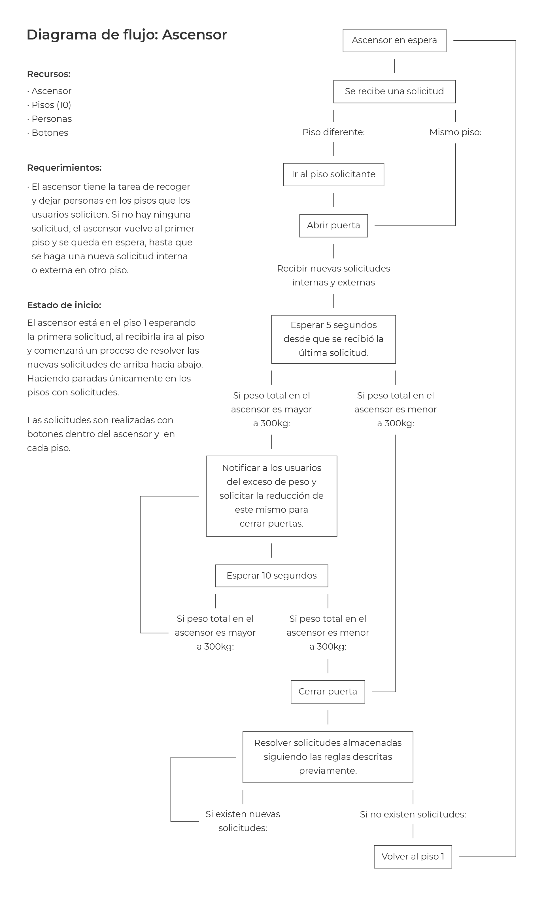
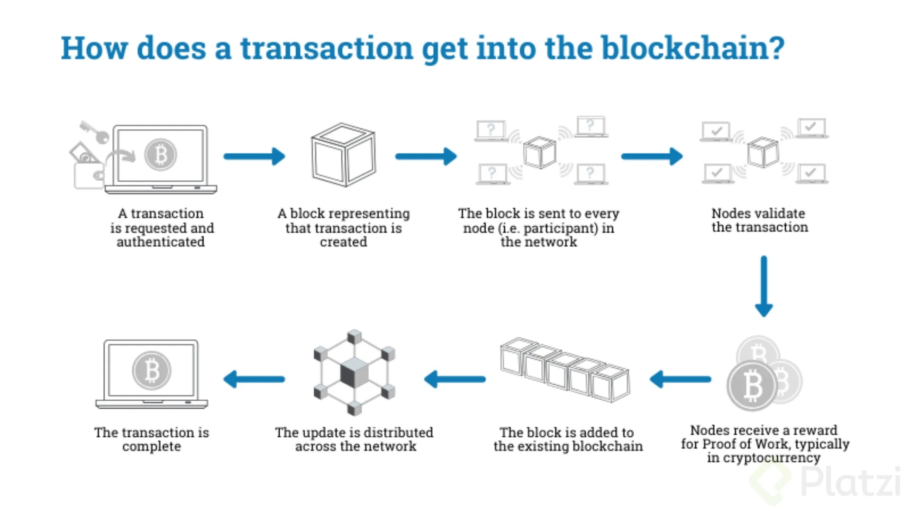
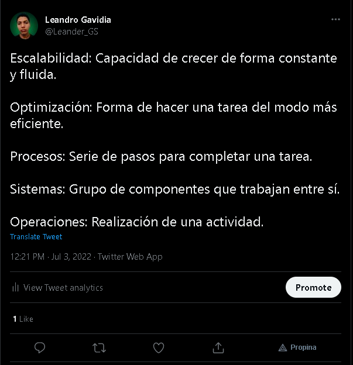

# **Ethereum program developer**

 

## **Reto 1 - Importancia del Manejo de Memoria**

---

 

- ### **Actividad 1:** Diagrama de flujo - ascensor.

 

 

---

 

- ### **Actividad 2:** Lista de palabras que desconozco o no entiendo, con su definición.

 

 

1. **Autenticada(o):** Autenticar se refiere a validar y/o verificar que una información, documento, datos... Es verdadero y no tiene ningún problema. Cuando decimos que algo está autenticado, como una transacción, nos referimos que esto mismo ya ha sido comprobado como lo que dice o debería ser.

 

2. **Nodo:** El significado de nodo varía mucho dependiendo del área de estudio. Sin embargo, dentro de la informática un nodo es un punto de unión, intersección o conexión de 2 o más elementos.

 

3. **Participante:** Un participante es una persona, usuario, miembro... Que toma parte de una actividad y/o proceso de forma activa.

 

4. **Validado(a):** Validar es el proceso de comprobar que una cosa o persona cumple con un estándar de especificaciones o reglas, principalmente creadas por seguridad. Cuando algo está validado, nos referimos que cumple con estas mismas especificaciones y normas y gana cierto valor de confianza.

 

5. **Actualización:** Es un proceso el cual tiene como objetivo lograr que algo se transforme en algo más nuevo y/o actual, esto a través de mejoras, nuevos datos, información, resolución de problemas, compatibilidad con nuevas tecnologías...

 

---

 

- ### **Actividad 3:** Tweet: ¿Qué es la escalabilidad, optimización, Procesos...?

 

1. **[Enlace al tweet](https://twitter.com/androgavidia/status/1543631000537808897)**

 

 

---
